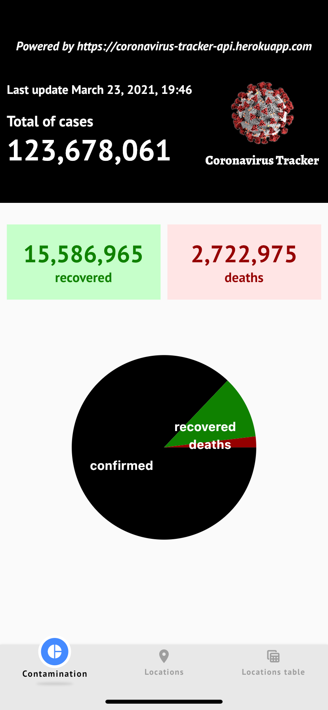
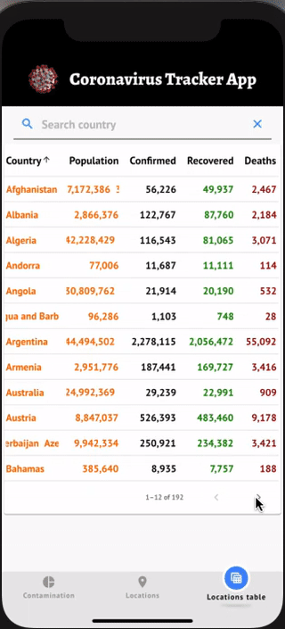
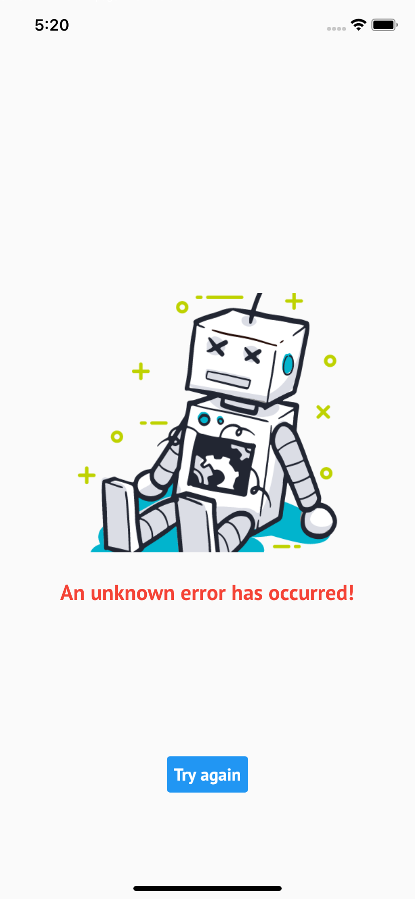
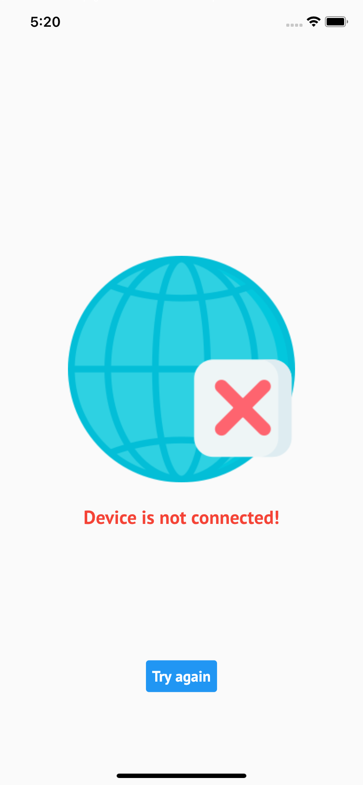

# Coronavirus Tracker App

Aplicação para consulta dos dados de covid.

## Tecnologias/bibliotecas

Algumas das tecnologias/bibliotecas utilizadas na construção desse aplicativo foram:

- **Framework:** Flutter 2.0.2 (null safety) e dart 2.12.1
- **Provider:** flutter_riverpod, incluindo injeção de dependência
- **Acesso à API:** Pacote http
- **Verificação de conexão:** pacote connectivity
- **Mapa de localidades:** flutter_map
- **Mock para os testes:** Mocktail

Além dessas, há também outras bibliotecas. O pubspec.yaml possui a lista completa das bibliotecas utilizadas.

## Relatórios

### Dados gerais (contamination tab)

Dados totais da contaminação pelo mundo, como:

1 - Endereço da api utlizada (cabeçalho da aplicação)
2 - Data da última atualização
3 - Total de casos (cases)
4 - Total de recuperados (recovered)
5 - Total de mortes (deaths)

Ao final um gráfico mostrando a proporção dos dados gerais da contaminação.

### Dados por localidade (Locations tab)

Dados de contaminação de cada país. Nesse caso é um mapa com um marcador para cada país onde, ao clicar nesse marcador, uma janela (popup) apresenta os detalhes de contaminação (país, casos, recuperados e mortos).

### Tabela dos dados de localidades (Locations table tab)

O relatório de dados por localidade, por ser uma consulta individual, não permite uma visão abrangente sobre as contaminações do coronavirus ao redor do mundo, como, por exemplo, quais os países com o maior e menor números de confirmados, recuperados e mortos.

## Erros

A aplicação pode apresentar os seguintes erros:

- **An unknown error has occurred!:** algum erro não identificado na api utilizada.
- **Device is not connected!:** desconexão ou alta latência de rede, impedindo que o dispositivo acesse a api

  
  

Ao final da página tem um botão chamando **Try again**, permitindo que o usuário tente realizar uma nova busca dos dados, sem a necessidade de reiniciar o aplicativo.

## API de consulta

<https://coronavirus-tracker-api.herokuapp.com>
