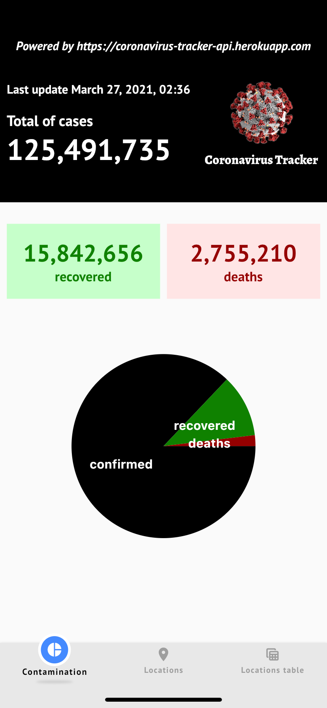

# Coronavirus Tracker App

Aplicação para consulta dos dados de covid.

## Dados

### Dados gerais

Dados totais da contaminação pelo mundo. Dados como:

1 - Endereço da api utlizada (cabeçalho da aplicação)
2 - Data da última atualização
3 - Total de casos (cases)
4 - Total de recuperados (recovery)
5 - Total de mortes (deaths)

Ao final um gráfico mostrando a proporção dos dados gerais da contaminação.

### Dados por localidade

Dados de contaminção de cada país. Nesse caso é um mapa com um marcador para cada país onde, ao clicar nesse marcador, uma janela (popup) mostra os detalhes de contaminação (país, casos, recuperados e mortos).

## Erros

A aplicação pode apresentar dois tipos de erros:

- **An unknown error has occurred!:** algum erro não identificado na api utilizada.
- **Device is not connected!:** desconexão ou alta latência de rede, impedindo que o dispositivo acesse a api

  
  

Abaixo da figura e de sua respectiva mensagem tem um botão chamando **Try again**, permitindo que o usuário tente realizar uma nova busca dos dados, sem a necessidade de reiniciar o aplicativo.

## API de consulta

<https://coronavirus-tracker-api.herokuapp.com>
